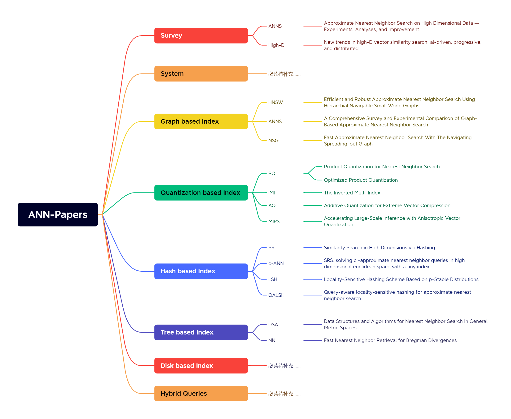

# ANN-Papers

# Introduction

The project is a collection of recent research in areas such as ANN(Approximate Nearest Neighbor) and Vector Database, including research reports, academic papers and datasets etc.

**We also hold regular paper readings together, so feel free to share your ideas. [link](https://github.com/Unstructured-Data-Community/talk/blob/main/paper-reading.md)**

该项目收集了ANN（近似近邻搜索）和向量数据库等领域的最新研究，包括研究报告、学术论文和数据集等。

**我们还会定期举办论文共读活动，欢迎共同交流。[链接](https://github.com/Unstructured-Data-Community/talk/blob/main/paper-reading.md)**

# Contribution

Contributions are always welcome! Make an individual pull request for each suggestion.

# Paper Reading Togeter 🥰
[paper reading list](https://github.com/Unstructured-Data-Community/talk/blob/main/paper-reading.md)

# Content

- 1 [Survey](https://github.com/Unstructured-Data-Community/ANN-Papers#1-survey-more)

- 2 [System](https://github.com/Unstructured-Data-Community/ANN-Papers#2-system-more)

- 3 [Graph based Index](https://github.com/Unstructured-Data-Community/ANN-Papers#3-graph-based-index-more)

  - 3.1 [Query Optimization](https://github.com/Unstructured-Data-Community/ANN-Papers#31-query-optimization)
  - 3.2 [New hardware acceleration](https://github.com/Unstructured-Data-Community/ANN-Papers#32-new-hardware-acceleration)
  - 3.3 [kNN-graph](https://github.com/Unstructured-Data-Community/ANN-Papers#33-knn-graph)

- 4 [Quantization based Index](https://github.com/Unstructured-Data-Community/ANN-Papers#4-quantization-based-index-more)

  - 4.1 [New hardware acceleraton](https://github.com/Unstructured-Data-Community/ANN-Papers#41-new-hardware-acceleraton)
  - 4.2 [Query Optimization](https://github.com/Unstructured-Data-Community/ANN-Papers#42-query-optimization)

- 5 [Hash based Index](https://github.com/Unstructured-Data-Community/ANN-Papers#5-hash-based-index-more)

  - 5.1 [New hardware adaptation](https://github.com/Unstructured-Data-Community/ANN-Papers#51-new-hardware-adaptation)
  - 5.2 [Query Optimization](https://github.com/Unstructured-Data-Community/ANN-Papers#52-query-optimization)
  - 5.3 [Learning to Hash(L2H)](https://github.com/Unstructured-Data-Community/ANN-Papers#53-learning-to-hash-l2h)
  
- 6 [Tree based Index](https://github.com/Unstructured-Data-Community/ANN-Papers#6-tree-based-index-more)

- 7 [Disk based Index](https://github.com/Unstructured-Data-Community/ANN-Papers#7-dish-based-index-more)

- 8 [Hybrid Queries](https://github.com/Unstructured-Data-Community/ANN-Papers#8-hybrid-queries-more)

## Relevant papers

### 1 Survey [more](./content/Survey.md)

(必读)[1] **Approximate Nearest Neighbor Search on High Dimensional Data — Experiments, Analyses, and Improvement** TKDE 2020.[paper](https://arxiv.org/pdf/1610.02455.pdf)

*Wen Li, Ying Zhang , Yifang Sun, Wei Wang, Mingjie Li , Wenjie Zhang , Xuemin Lin*

---

(必读)[2] **New trends in high-D vector similarity search: al-driven, progressive, and distributed** VLDB 2021. [paper](http://vldb.org/pvldb/vol14/p3198-echihabi.pdf)      [slid](https://vldb.org/2021/files/slides/tutorial/tutorial5.pdf)

*Karima Echihabi, Kostas Zoumpatianos, Themis Palpanas*

---

### 2 System [more](./content/System.md)

待补充

---

### 3 Graph based Index [more](./content/Graph-based-Index.md)

(必读)[1] **Efficient and Robust Approximate Nearest Neighbor Search Using Hierarchial Navigable Small World Graphs** HNSW 2020. [paper](https://arxiv.org/pdf/1603.09320.pdf)

*Yu A. Malkov, D. A. Yashunin*

---

[2]（[1]的基础，可作为参考） **Approximate nearest neighbor algorithm based on navigable small world graphs** Information Systems
Volume 45, September 2014, Pages 61-68. [paper](https://www.sciencedirect.com/science/article/abs/pii/S0306437913001300)

*Yury Malkov, Alexander Ponomarenko, Andrey Logvinov, Vladimir Krylov*

---

(必读)[3] **A Comprehensive Survey and Experimental Comparison of Graph-Based Approximate Nearest Neighbor Search** VLDB 2022. [paper](https://arxiv.org/pdf/2101.12631v1.pdf)

*Mengzhao Wang, Xiaoliang Xu, Qiang Yue, Yuxiang Wang*

---

(必读)[4] **Fast Approximate Nearest Neighbor Search With The Navigating Spreading-out Graph** VLDB 2019. [paper](https://arxiv.org/pdf/1707.00143.pdf)

*Cong Fu, Chao Xiang, Changxu Wang, Deng Cai*

---

#### 3.1 Query Optimization

待补充

---

#### 3.2 New hardware acceleration

待补充

---

#### 3.3 kNN-graph

待补充

---

### 4 Quantization based Index [more](./content/Quantization-based-Index.md)

(必读)[1] **Product Quantization for Nearest Neighbor Search** TPAMI 2019. [paper](https://hal.inria.fr/inria-00514462v2/document)

*Herve J ´ egou, Matthijs Douze, Cordelia Schmid*

---

(必读)[2] **Optimized Product Quantization** TPAMI 2013. [paper](https://ieeexplore.ieee.org/document/6678503)

*Tiezheng Ge, Kaiming He, Qifa Ke, Jian Sun*

---

(必读)[3] **The Inverted Multi-Index** TPAMI 2014. [paper](https://ieeexplore.ieee.org/document/6915715)

*Artem Babenko, Victor Lempitsky*

---

(必读)[4] **Additive Quantization for Extreme Vector Compression** CVPR 2014. [paper](https://ieeexplore.ieee.org/document/6909519/)

*Artem Babenko, Victor Lempitsky*

----

(必读)[5]**Accelerating Large-Scale Inference with Anisotropic Vector Quantization** 	ICML 2020. [paper](https://arxiv.org/pdf/1908.10396.pdf)

*Ruiqi Guo, Philip Sun, Erik Lindgren*

---

#### 4.1 New hardware acceleration

待补充

---

#### 4.2 Query Optimization

待补充

---

### 5 Hash based Index [more](./content/Hash-based-Index.md)

(必读)[1] **Similarity Search in High Dimensions via Hashing** VLDB 1999. [paper](https://www.vldb.org/conf/1999/P49.pdf)

*Aristides Gionis, Piotr Indyk, Rajeev Motwani*

---

(必读)[2] **SRS: solving c -approximate nearest neighbor queries in high dimensional euclidean space with a tiny index** VLDB 2014. [paper](https://vldb.org/pvldb/vol8/p1-sun.pdf)

*Yifang Sun, Wei Wang, Jianbin Qin, Ying Zhang, Xuemin Lin*

---

(必读)[3] **Locality-Sensitive Hashing Scheme Based on p-Stable Distributions** SCG 2004.[paper](https://dl.acm.org/doi/10.1145/997817.997857)

*Mayur Datar, Nicole Immorlica, Piotr Indyk, Vahab S. Mirrokni*

---

(必读)[4] **Query-aware locality-sensitive hashing for approximate nearest neighbor search** VLDB 2015. [paper](https://dl.acm.org/doi/10.14778/2850469.2850470)

*Qiang Huang, Jianlin Feng, Yikai Zhang*

---

#### 5.1 Hardware adaptation

待补充

---

#### 5.2 Query Optimization

待补充

---

#### 5.3 Learning to Hash (L2H)

待补充

---

### 6 Tree based Index [more](./content/Tree-based-Index.md)

(必读)[1]**Data Structures and Algorithms for Nearest Neighbor Search in General Metric Spaces** SODA 1993. [paper](https://dl.acm.org/doi/pdf/10.5555/313559.313789)

*Peter N. Yianilos*

---

(必读)[2]**Fast Nearest Neighbor Retrieval for Bregman Divergences** ICML 2008. [paper](https://dl.acm.org/doi/10.1145/1390156.1390171)

*Lawrence Cayton*

---

### 7 Disk based Index [more](./content/Disk-based-Index.md)

待补充

---

### 8 Hybrid Queries [more](./content/Hybrid-Queries.md)

待补充

___
## Contributors

Made with [contrib.rocks](https://contrib.rocks).

## LICENSE

[Apache-2.0 license](./LICENSE)

